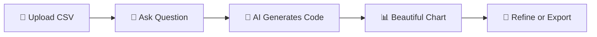

<div align="center">

# 📊 ChartGPT

### *Transform Data into Insights with the Power of AI*

[](https://www.python.org/)
[](https://dash.plotly.com/)
[](https://www.docker.com/)
[](https://huggingface.co/)

**[Try it Live](https://huggingface.co/spaces)** • **[Documentation](#how-it-works)** • **[Report Bug](https://github.com/chatgpt/chart/issues)**

</div>

---

## 🎯 What is ChartGPT?

Forget complex charting libraries and endless documentation. **ChartGPT** lets you create stunning, interactive visualizations by simply asking for what you want in plain English. Upload your CSV, ask a question, and watch as AI generates the perfect chart for your data.

```
You: "Show me a correlation heatmap of all numeric columns"
ChartGPT: *generates beautiful visualization + Python code*
```

No coding required. No chart selection headaches. Just data insights at the speed of thought.

---

## ✨ Features

<table>
<tr>
<td width="50%">

### 🤖 **AI-Powered Magic**
Natural language to beautiful charts. Powered by Qwen2.5-Coder-32B-Instruct for intelligent code generation.

### 🎨 **Dark Mode**
Easy on the eyes. Toggle between light and dark themes with a single click.

### 📤 **Drag & Drop Upload**
No complicated file pickers. Just drag your CSV and you're ready to go.

### 🔍 **Code Transparency**
See exactly how your chart was created. Every visualization comes with the Python code.

</td>
<td width="50%">

### ⚡ **Real-Time Preview**
Interactive data tables with sorting, filtering, and search before you even create charts.

### 🔄 **Iterative Refinement**
Not happy with the result? Ask again and refine your visualization instantly.

### 🐳 **Deploy Anywhere**
Docker-ready. Deploy to Hugging Face Spaces, Heroku, Railway, or your own server in minutes.

### 🎯 **Smart & Fast**
Built with modern tech stack for lightning-fast responses and smooth interactions.

</td>
</tr>
</table>

---

## 🚀 How It Works

<div align="center">



</div>

### 1️⃣ Upload Your Data
Drag and drop any CSV file (up to 5MB). Instantly preview your data in an interactive table.

### 2️⃣ Ask Your Question
Type naturally:

- *"Show me monthly revenue trends as a line chart"*
- *"Create a bar chart comparing product categories"*
- *"Plot the distribution of customer ages"*
- *"Make a scatter plot of price vs. quantity sold"*

### 3️⃣ Get Instant Results
ChartGPT analyzes your data, writes the visualization code, and renders your chart in seconds. View the generated Python code anytime.

---

## 🛠️ Tech Stack

Built with cutting-edge technologies for the best developer and user experience:

- 🎯 **[Dash](https://dash.plotly.com/)** — Reactive web application framework
- 🤖 **[ChartGPT Library](https://pypi.org/project/chartgpt/)** — AI-powered chart generation engine
- 🎨 **[Dash Mantine Components](https://www.dash-mantine-components.com/)** — Beautiful, modern UI components
- 📊 **[Plotly](https://plotly.com/)** — Interactive, publication-quality visualizations
- 📈 **[Dash AG Grid](https://dash.plotly.com/dash-ag-grid)** — Professional data tables
- 🧠 **[Hugging Face Qwen2.5-Coder](https://huggingface.co/Qwen)** — State-of-the-art code generation LLM

---

## 💻 Installation

### 🐍 Local Setup

Clone and run in under 2 minutes:

```bash
# Clone the repository
git clone https://github.com/yourusername/chartgpt.git
cd chartgpt

# Create virtual environment
python -m venv venv
source venv/bin/activate  # Windows: venv\Scripts\activate

# Install dependencies
pip install -r requirements.txt

# Set up your Hugging Face token
echo "HUGGINGFACE_API_KEY=your_token_here" > .env

# Launch the app
python app.py
```

🎉 Open your browser to `http://localhost:8050`

### 🐳 Docker Setup

Even easier with Docker:

```bash
# Build the image
docker build -t chartgpt .

# Run the container
docker run -p 7860:7860 chartgpt
```

🎉 Access at `http://localhost:7860`

---

## 🎮 Usage Tips

| Tip | Description |
|-----|-------------|
| 💡 **Be Specific** | "Line chart of sales over time" works better than "show sales" |
| 🔄 **Iterate** | Use "Ask again" to refine your visualizations |
| 📏 **File Size** | Keep CSVs under 5MB for optimal performance |
| 🎨 **Explore** | Try different chart types: scatter, bar, line, pie, heatmap, etc. |
| 👀 **Inspect Code** | Learn from the generated Python code |

---

## 📁 Project Structure

```
chartgpt/
├── 🐍 app.py                   # Main Dash application
├── 📦 requirements.txt         # Python dependencies
├── 🐳 Dockerfile              # Container configuration
├── 📂 assets/
│   ├── 🌙 logo_dark.svg       # Logo for light theme
│   ├── ☀️  logo_light.svg      # Logo for dark theme
│   └── 🎨 custom.css          # Custom styling
└── 📖 README.md               # You are here!
```

---

## 🔧 Configuration

Customize the AI model in `app.py` (line 464):

```python
# Switch to different models
chart = cg.Chart(df, model="huggingface/Qwen/Qwen2.5-Coder-32B-Instruct")

# Try other options:
# model="openai/gpt-4"
# model="anthropic/claude-3-sonnet"
```

---

## 🚀 Deployment

### Hugging Face Spaces (Recommended)

Perfect for sharing with the world:

1. Create a new Space on [Hugging Face](https://huggingface.co/spaces)
2. Select **Docker** as the SDK
3. Push your code to the Space repository
4. Add your `HUGGINGFACE_API_KEY` in Settings → Repository secrets
5. Your app goes live automatically!

### Other Platforms

Deploy anywhere containers run:

| Platform | Method |
|----------|--------|
| 🚂 **Railway** | Connect GitHub repo, auto-deploy on push |
| 🟣 **Heroku** | Use included Dockerfile with Heroku Container Registry |
| ☁️ **AWS/GCP/Azure** | Deploy as containerized web service |
| 🖥️ **VPS** | Run with `gunicorn -b 0.0.0.0:7860 app:server` |

---

## 🤝 Contributing

We love contributions! Here's how to get started:

```bash
# Fork the repo, then clone your fork
git clone https://github.com/YOUR_USERNAME/chartgpt.git

# Create a feature branch
git checkout -b feature/amazing-feature

# Make your changes and commit
git commit -m '✨ Add amazing feature'

# Push to your fork
git push origin feature/amazing-feature

# Open a Pull Request
```

---

## 📜 License

This project is licensed under the **MIT License** — feel free to use it however you'd like!

---

## 🙏 Acknowledgments

Standing on the shoulders of giants:

- 🎯 [ChartGPT Library](https://github.com/chartgpt/chartgpt) — Core AI chart generation
- ⚡ [Plotly Dash Team](https://dash.plotly.com/) — Amazing web framework
- 🎨 [Mantine Dev](https://mantine.dev/) — Beautiful component library
- 🧠 [Qwen Team](https://huggingface.co/Qwen) — Powerful open-source LLM

---

## 🔗 Connect

<div align="center">

[](https://github.com/chatgpt/chart)
[](https://www.linkedin.com/in/eliebrosset/)

</div>

---

<div align="center">

**Made with ❤️ and AI**

*Transform your data, one question at a time*

</div>
